<!-- добавить скрин из objdump что с O3 версия с массивами (Unrolled) компилируется в avx инструкции -->


<!-- used avx512 instructions (zmm registers consisting of 16 floats = 64 bytes)<br>


one test time in average = 1 min<br>
tests number = 7<br>


theoretical maximum = x16 speed<br> -->

# Оптимизация вычислений точек множества Мандельброта с помощью SIMD-инструкций

|                                       |                                               |
|---------------------------------------|-----------------------------------------------|
|Операционная система                   | Linux Mint 22.3                               |
|Ядро                                   | Linux 6.17.0-19-generic                       |
|Архитектура                            | x86-64                                        |
|Процессор                              | 11th Gen Intel(R) Core(TM) i5-11320H @ 3.20GHz|
|Среднее время одного теста             | 1 минута                                      |
|Количество тестов на 1 вид оптимизации | 7                                             |
|Средняя температура процессора         | 50 °C                                         |
|Средняя частота процессора             | 2800 Ghz                                      |
|Использованные опции компилятора       | `-O2`/`-O3`/`-O fast` и `-march=native`       |
|Версия компилятора g++                 | 13.3.0                                        |
|Версия компилятора clang++             | 18.1.3                                        |

<!-- 
| Оптимизация               |    Среднее значение циклов  |  Стандартное отклонение  | Погрешность | Относительная погрешность, % |
| ------------------------- | --------------------------- | ------------------------ | ------------|----------------------------- |
| naive:  g++ -O2           |   4.09e+11   |  8.05e+07  |  3.04e+07 | 0.007 |
| naive:  g++ -O3           |   4.08e+11   |  4.80e+07  |  1.82e+07 | 0.004 |
| naive:  g++ -Ofast        |   4.05e+11   |  1.38e+07  |  5.21e+06 | 0.001 |
| arrays: g++ -O2           |   3.08e+10   |  2.60e+06  |  9.83e+05 | 0.003 |
| arrays: g++ -O3           |   1.69e+11   |  8.29e+06  |  3.13e+06 | 0.002 |
| arrays: g++ -Ofast        |   1.76e+11   |  1.18e+07  |  4.47e+06 | 0.003 |
| avx:    g++ -O2           |   2.67e+10   |  4.58e+06  |  1.73e+06 | 0.006 |
| avx:    g++ -O3           |   2.67e+10   |  3.07e+06  |  1.16e+06 | 0.004 |
| avx:    g++ -Ofast        |   2.67e+10   |  1.89e+06  |  7.15e+05 | 0.003 |
| naive:  clang++ -O2       |   3.98e+11   |  2.69e+07  |  1.02e+07 | 0.003 |
| naive:  clang++ -O3       |   3.98e+11   |  5.75e+07  |  2.17e+07 | 0.005 |
| naive:  clang++ -Ofast    |   4.16e+11   |  6.51e+07  |  2.46e+07 | 0.006 |
| arrays: clang++ -O2       |   1.04e+11   |  1.55e+07  |  5.85e+06 | 0.006 |
| arrays: clang++ -O3       |   1.05e+11   |  6.68e+06  |  2.53e+06 | 0.002 |
| arrays: clang++ -Ofast    |   1.02e+11   |  1.74e+07  |  6.58e+06 | 0.006 |
| avx:    clang++ -O2       |   2.88e+10   |  1.13e+07  |  4.27e+06 | 0.015 |
| avx:    clang++ -O3       |   2.88e+10   |  1.19e+07  |  4.50e+06 | 0.016 |
| avx:    clang++ -Ofast    |   2.32e+10   |  1.05e+07  |  3.95e+06 | 0.017 | -->


#### Сравниваются три реализации:
1) naive: наивная версия, с расчетом одной точки за цикл
2) arrays: версия с расчетом восьми точек за цикл при помощи массивов
2) avx: версия с расчетом восьми точек за цикл с использованием интринсиков

Измерение времени исполнения программы производится с помощью инструкции rdtsc().
За один тест считаются 500 точек. Всего 4 теста для прогрева и 7 рабочих.
Затем высчитывается среднее значение и стандартное отклонение для каждого случая.
Получившиеся замеры представлены в двух таблицах: с абсолютными значениями тактов, а также в виде отношения - коэффициента, отображающего, насколько ускорилась программа по сравнению с неоптимизированной версией.

### Абсолютные значения

<table>
  <thead>
    <tr><th rowspan="3">Версия</th><th colspan="6">Количество тактов, 10^10</th></tr>
    <tr><th colspan="3">g++</th><th colspan="3">clang++</th></tr>
    <tr><th>-O2</th><th>-O3</th><th>-Ofast</th><th>-O2</th><th>-O3</th><th>-Ofast</th></tr></thead>
  <tbody>
    <tr><td>naive</td><td>40.90</td><td>40.80</td><td>40.50</td><td>39.80</td><td>39.80</td><td>41.60</td></tr>
    <tr><td>arrays</td><td>3.08</td><td>16.90</td><td>17.60</td><td>10.40</td><td>10.50</td><td>10.20</td></tr>
    <tr><td>avx</td><td>2.67</td><td>2.67</td><td>2.67</td><td>2.88</td><td>2.88</td><td>2.32</td></tr>
  </tbody>
</table>


### Отношение


<table>
  <thead>
    <tr><th rowspan="3">Версия</th><th colspan="6">Ускорение по сравнению с версией naive -O2</th></tr>
    <tr><th colspan="3">g++</th><th colspan="3">clang++</th></tr>
    <tr><th>-O2</th><th>-O3</th><th>-Ofast</th><th>-O2</th><th>-O3</th><th>-Ofast</th></tr></thead>
  <tbody>
    <tr><td>naive</td><td>1.00</td><td>1.00</td><td>1.01</td><td>1.03</td><td>1.03</td><td>0.98</td></tr>
    <tr><td>arrays</td><td>13.25</td><td>2.42</td><td>2.33</td><td>3.92</td><td>3.90</td><td>4.01</td></tr>
    <tr><td>avx</td><td>15.30</td><td>15.30</td><td>15.32</td><td>14.18</td><td>14.18</td><td>17.62</td></tr>
  </tbody>
</table>

## Анализ дизассемблера, полученного с помощью godbolt.org

### Анализ версии arrays при компиляции g++ с -O2 против -O3

В случае версии с массивами при компиляции с помощью g++ оптимизация -O2 оказалась в 6 раз быстрее оптимизации -O3.
Компилятор при опции -O2 смог применить векторизацию и использовать SIMD-инструкции. Однако в случае
с -O3 компилятор использует множество скалярных операций и обращений к стеку.
Это может быть связано с применением более агрессивных оптимизаций, таких как Loop Unrolling. Код разрастается, и из-за этого компилятор не может применить векторизацию.


Слева скриншот дизассемблера при компиляции с флагом -O2. Справа - c флагом -O3.
<table>
<tr>
<td>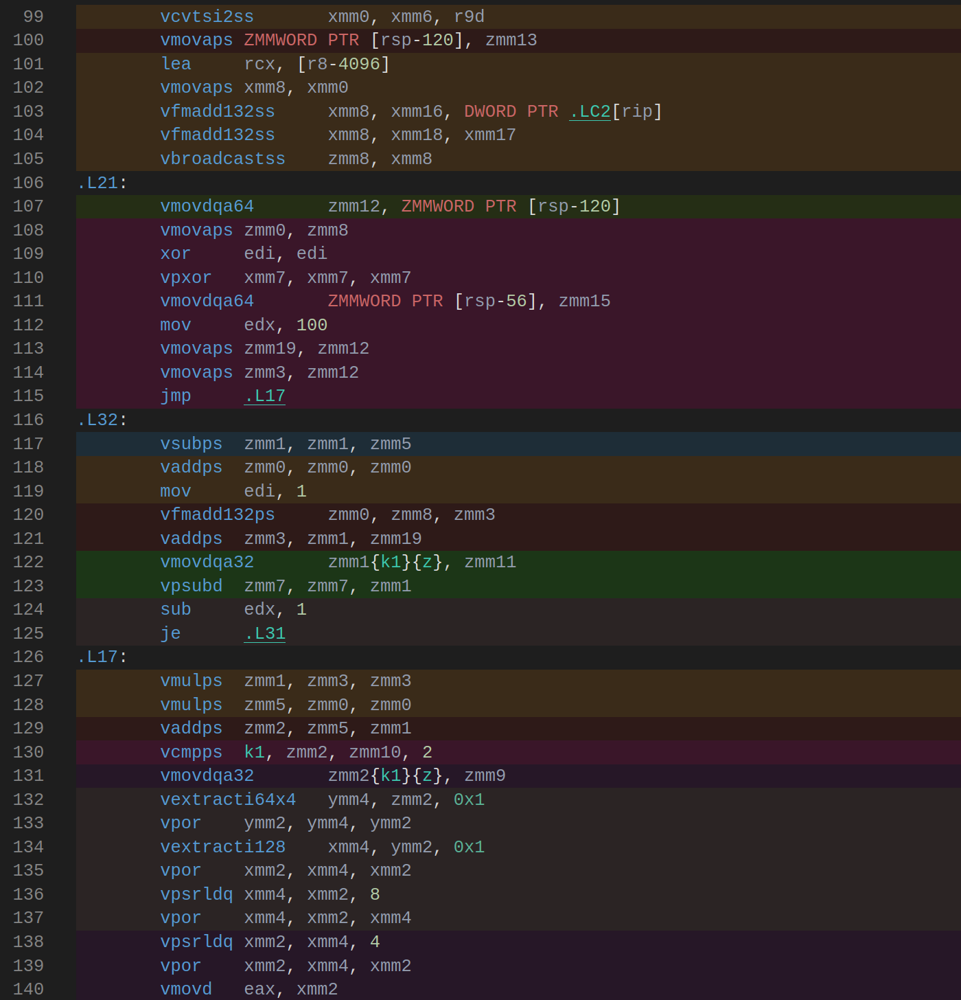</td>
<td>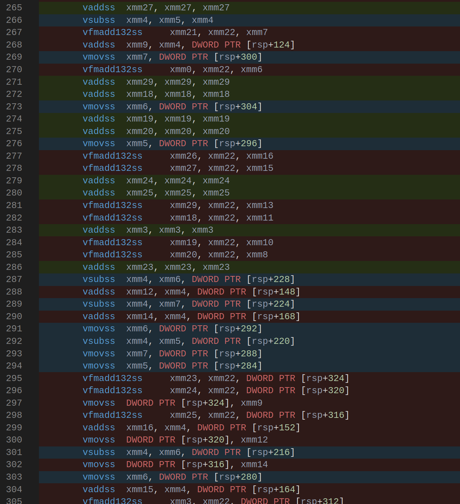</td>
</tr>
</table>


<!-- ## clang++ O3 vs Ofast (avx version)
<table>
<tr>
<td>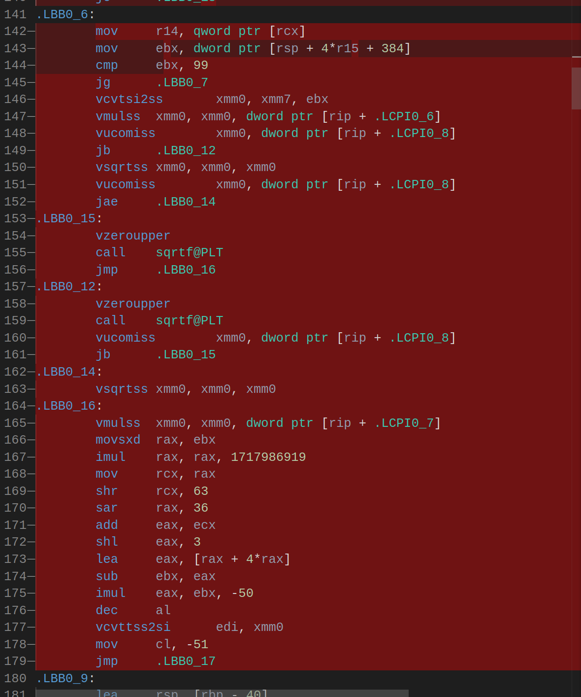</td>
<td>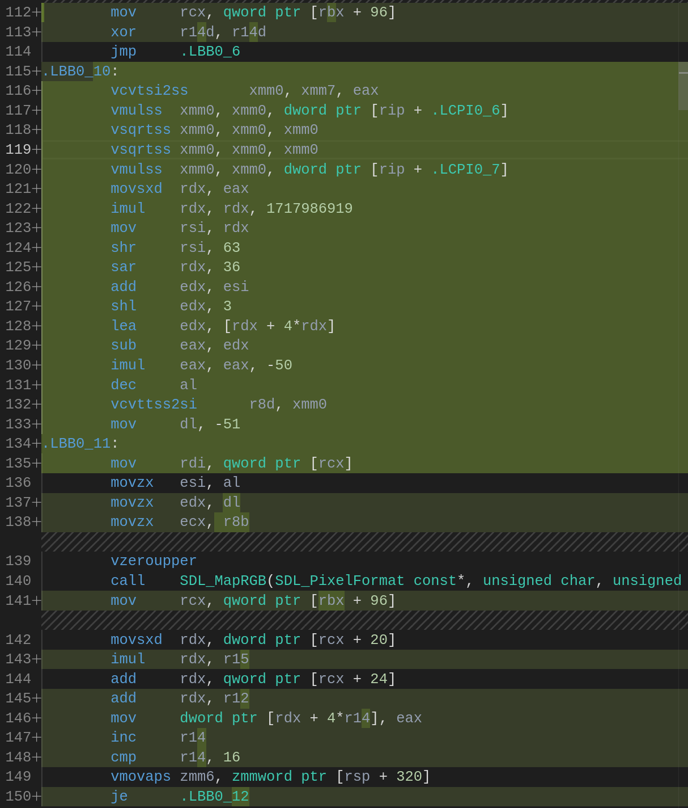</td>
</tr>
</table> -->

### Анализ версии arrays при компиляции clang++ с -O2

В отличие от g++, компилятор clang++ в версии с массивами не смог полностью векторизовать код, используя частично xmm и частично ymm регистры.
Из-за этого версия, скомпилированная компилятором clang оказалась примерно в 2 раза медленнее.


<table>
<tr>
<td>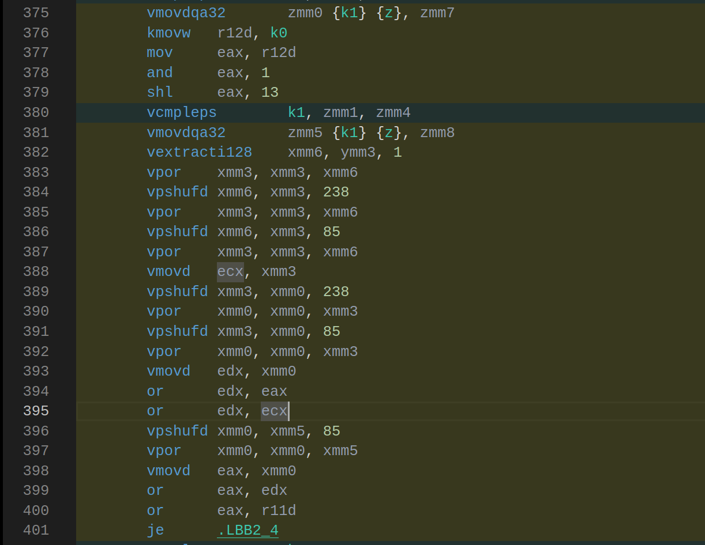</td>
<td>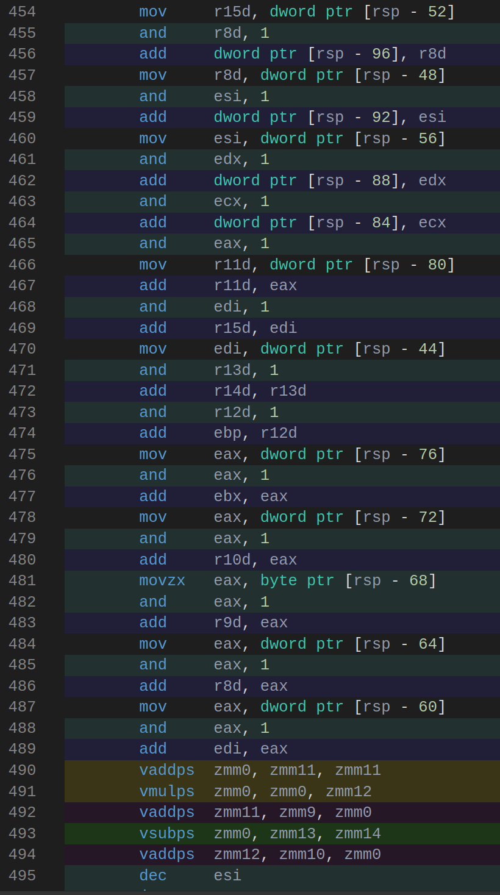</td>
</tr>
</table>

### Анализ версии avx при компиляции clang++ с -O3 против -Ofast

Разберемся, почему при компиляции clang с флагом оптимизации -O3 код ускорился в 14.18 раз, а с флагом -Ofast аж в целых 17.62 раз! Для этого посмотрим дизассемблированный код с помощью утилиты objdump.

Однако, код функций MandelbrotIntrinsics512 и MakeTests абсолютно одинаков.

<p align="center">
    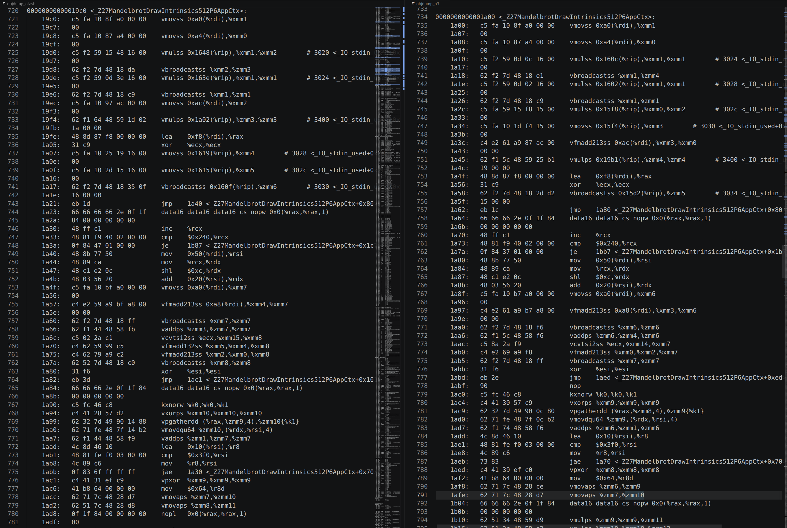
</p>

Откуда же тогда ускорение?

В версии, скомпилированной с флагом оптимизации -Ofast есть только одно отличие - функция set_fast_math.

Что же она делает?

Она использует инструкции **stmxcsr** и **ldmxcsr**, считывающие и загружающие содержимое регистра MXCSR соответственно.

<p align="center">
    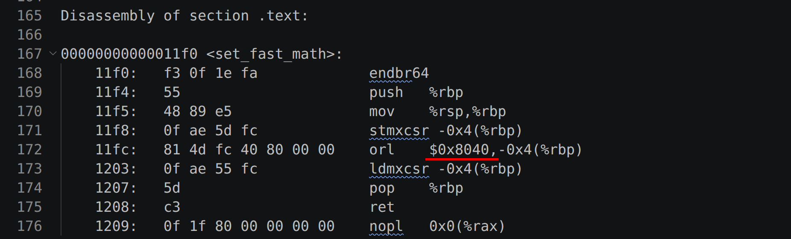
</p>

Управляющий регистр MXCSR (SIMD Floating-Point Control/Status Register) предназначен для маскирования/демаскирования SIMD-исключений, управления режимом округления, а также включения режима сдвига к нулю.
Что же именно меняет эта функция?

Для этого обратимся к флагам, которые устанавливает этот регистр, меняя поведение сопроцессора: 

<p align="center">
    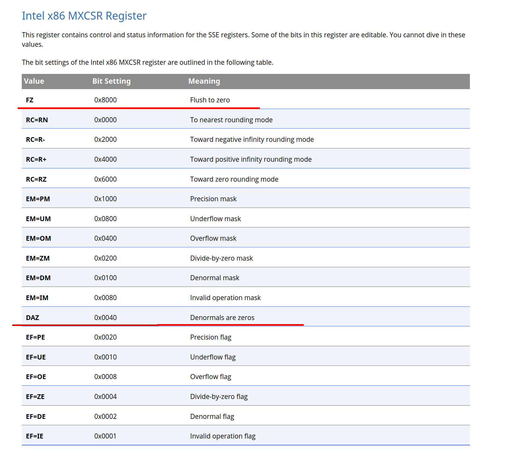
</p>

Итак, функция выставляет флаг FZ (Flush to zero) и DAZ (Denormals are zeros).

Таким образом, процессор отбрасывает денормализованные числа, считая их нулями, и уменьшает время вычислений.

## Гистограмма, показывающая сравнение времени исполнения различных версий 

<p align="center">
    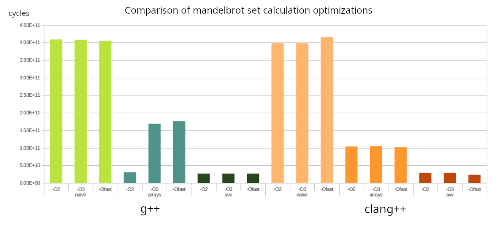
</p>


## Достоверность измерений

Необходимо убедиться в корректности полученных данных. Для этого я контролировал состояние процессора. А также ограничил его частоту, и привязал процесс к одному ядру с помощью *taskset*.
Для измерения состояния процессора была использована утилита **s-tui**. 
Данные, полученные с ее помощью, находятся в файле *cpu-data.csv*. 
Открыв файл в программе LibreOffice, я убедился что столбец Throttle пуст, что говорит
об отсутствии троттлинга в ходе проведения тестов.


### Как выглядит утилита s-tui
<p align="center">
    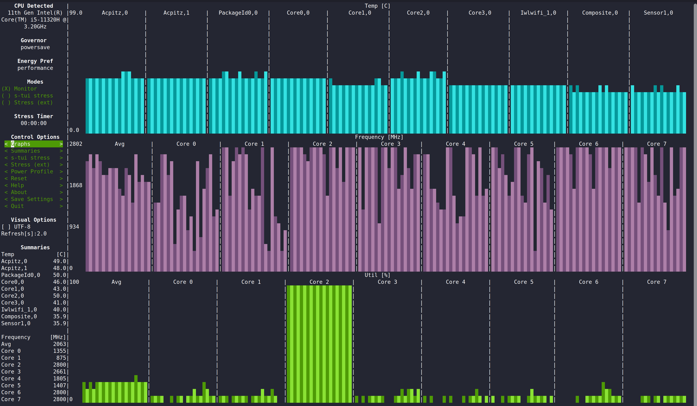
</p>


### Как выглядят данные, полученные с ее помощью
<p align="center">
    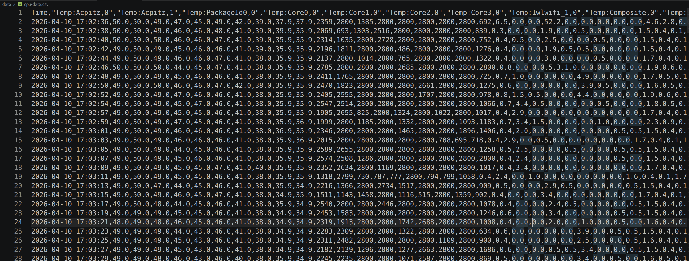
</p>


### Столбец Throttle пуст
<p align="center">
    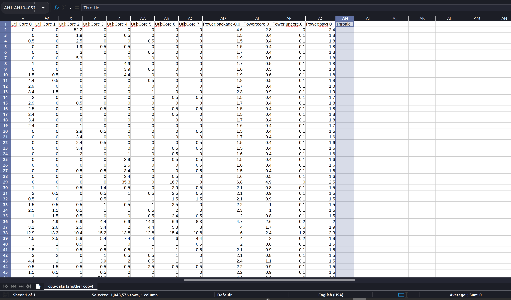
</p>

### График температуры ядра

<p align="center">
    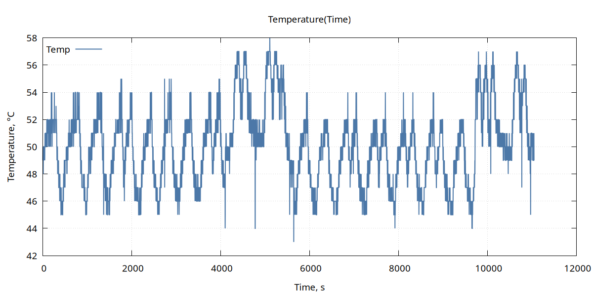
</p>

Температура при тестах не поднималась выше 60 градусов, что дополнительно подтверждает отсутствие влияния троттлинга на производительность процессора.

<!-- 
Проанализировав код с помощью gobolt.org, я обнаружил, что в теле цикла происходит много обращений в память,
там, где, казалось бы, можно использовать регистры. 
В памяти хранились различные константы и сдвиги по типу mm_x_increment, mm_delta_x_0to15, 
а также была ссылка на память, где лежала константа (1.0f / SCREEN_HEIGHT).

Я осознал, что это возможно связано с вызовом функции MandelbrotGetColor (я не рассматривал GfxPutPixel, так как она
была заинлайнена). Внутри функции MandelbrotGetColor был рассчет цвета по количеству итераций, а также вызов
SDL_MapRgb(), зависящей от формата SDL_Surface (про реализацию которой компилятор не знает). Так как векторные регистры 
могут быть испорчены в ходе вызова функции, компилятор решил сохранять некоторые долго живущие переменные на стеке,
и обращаться к ним вместо того, чтобы сохранять их перед каждым вызовом функции и возвращать после.

Также я понял, что всего цветов не так много (100) и они зависят только от количества итераций.
Однако вычисления цвета происходят для каждого пикселя. Поэтому я вынес вычисление цвета в таблицу
color_table и рассчитал ее перед вызовом рассчета точек множества Мандельброта. Таким образом,
я сократил количество вычислений и позволил компилятору понять, что не нужно сохранять векторные регистры на стеке.

Рассмотрим еще раз код, получившийся после этой оптимизации:

Как видно, код вычисления цвета заменился на цикл с обращением в память, который развертывается при флаге
оптимизации -O3. Однако в этой части стало много повторяющихся вычислений (вернемся к этому моменту позднее).

Итак, благодаря тому, что убрался вызов функции, компилятор перестал помещать долго живущие переменные в стек
и начал использовать для них регистры.

Однако осталось еще одно обращение в память в теле вложенного цикла. Оно происходит в инструкции `vfmadd132ss` (.LC4[rip]).
```c
  __m512 mm_y_start = _mm512_set1_ps(app->center_point_y + app->y_zoom_scale * ((float) pixel_y * (1.0f / SCREEN_HEIGHT) - 0.5f));
```
<p align="center">
    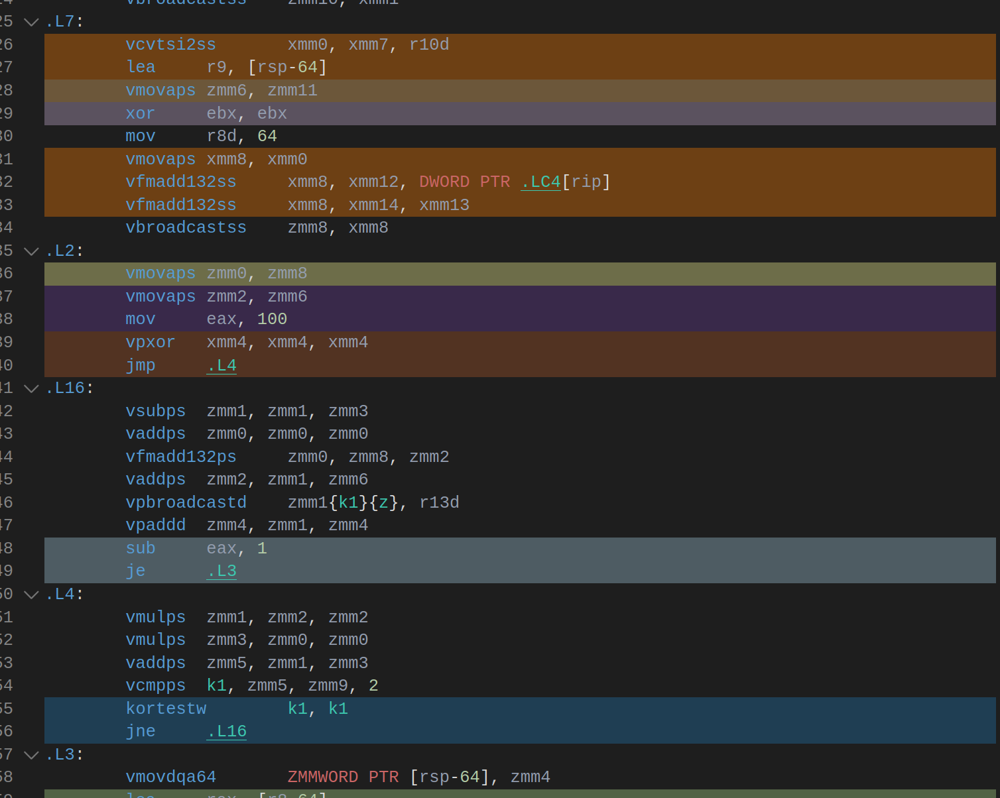
</p>

Нажав в godbolt Scroll to source, увидим, что это скомпилированная следующая строка:

```c
  __m512 mm_y_start = _mm512_set1_ps(y_adding + y_coeff * (float) pixel_y);
```

И да, пройдя по метке .LC4 убедимся, что это и есть константа (1.0f / SCREEN_HEIGHT).
Однако это вычисление можно упростить, так как в ходе цикла меняется только переменная pixel_y.
Для этого разобьём вычисления. Будем умножать pixel_y на константу и прибавлять сдвиг,
высчитанные до цикла:

Вычисление начальной координаты y_start:

Вычисление констант в начале функции:
```c
  float y_coeff = (1.0f / SCREEN_HEIGHT) * app->y_zoom_scale;
  float y_adding = app->y_zoom_scale * (-0.5f) + app->center_point_y; 
```

Убедимся, что оптимизация успешна, и компилятор использует исключительно регистры в инструкции `vfmadd132ss`


<p align="center">
    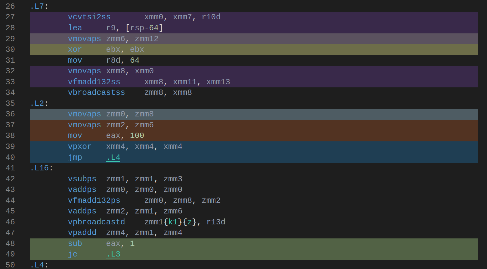
</p>
 -->
