<!-- добавить скрин из objdump что с O3 версия с массивами (Unrolled) компилируется в avx инструкции -->

<!-- used avx512 instructions (zmm registers consisting of 16 floats = 64 bytes) 

one test time in average = 1 min 
tests number = 7 

theoretical maximum = x16 speed  -->
   
|                                       |                                               |
|---------------------------------------|-----------------------------------------------|
|Операционная система                   | Linux Mint 22.3                               |
|Ядро                                   | Linux 6.17.0-19-generic                       |
|Архитектура                            | x86-64                                        |
|Процессор                              | 11th Gen Intel(R) Core(TM) i5-11320H @ 3.20GHz|
|Среднее время одного теста             | 1 минута                                      |
|Количество тестов на 1 вид оптимизации | 7                                             |
|Средняя температура процессора         | 55 °C                                         |
|Средняя частота процессора             | 2800 Ghz                                      |
|Использованные опции компилятора       | `-O2`/`-O3`/`-O fast` и `-march=native`   |

| Оптимизация               |    Среднее значение циклов  |  Стандартное отклонение  | Стандартное отклонение по отношению к значению, % |
| ------------------------- | --------------------------- | ------------------------ | ------------------------------------------------- |
| naive:  g++ -O2           |   4.173019e+11              |  1.258566e+07            | 0.0030
| naive:  g++ -O3           |   4.158351e+11              |  2.281580e+07            | 0.0055
| naive:  g++ -Ofast        |   4.126734e+11              |  4.583847e+07            | 0.0111
| arrays: g++ -O2           |   3.455407e+10              |  2.662869e+07            | 0.0771
| arrays: g++ -O3           |   1.942865e+11              |  2.117069e+08            | 0.1090
| arrays: g++ -Ofast        |   1.973030e+11              |  1.274780e+07            | 0.0065
| avx:    g++ -O2           |   3.139951e+10              |  4.852487e+06            | 0.0155
| avx:    g++ -O3           |   3.140024e+10              |  4.742596e+06            | 0.0151
| avx:    g++ -Ofast        |   3.148814e+10              |  7.503054e+06            | 0.0238
| naive:  clang++ -O2       |   4.065037e+11              |  4.498386e+07            | 0.0111
| naive:  clang++ -O3       |   4.071970e+11              |  3.338174e+07            | 0.0082
| naive:  clang++ -Ofast    |   4.238273e+11              |  1.656269e+08            | 0.0391
| arrays: clang++ -O2       |   6.251789e+10              |  5.335512e+06            | 0.0085
| arrays: clang++ -O3       |   6.259221e+10              |  6.369349e+07            | 0.1018
| arrays: clang++ -Ofast    |   6.004888e+10              |  2.734836e+06            | 0.0046
| avx:    clang++ -O2       |   3.397334e+10              |  2.068962e+06            | 0.0061
| avx:    clang++ -O3       |   3.441242e+10              |  4.068162e+06            | 0.0118
| avx:    clang++ -Ofast    |   2.754779e+10              |  7.173370e+06            | 0.0260

<table>
  <thead>
    <tr><th rowspan="3">optimization</th><th colspan="6">cycles, 10^10</th></tr>
    <tr><th colspan="3">g++</th><th colspan="3">clang++</th></tr>
    <tr><th>-O2</th><th>-O3</th><th>-Ofast</th><th>-O2</th><th>-O3</th><th>-Ofast</th></tr></thead>
  <tbody>
    <tr><td>naive</td><td>41.73</td><td>41.58</td><td>41.27</td><td>40.65</td><td>40.72</td><td>42.38</td></tr>
    <tr><td>arrays</td><td>3.46</td><td>19.43</td><td>19.73</td><td>6.25</td><td>6.26</td><td>6.00</td></tr>
    <tr><td>avx</td><td>3.14</td><td>3.14</td><td>3.15</td><td>3.40</td><td>3.44</td><td>2.75</td></tr>
  </tbody>
</table>

<table>
  <thead>
    <tr><th rowspan="3">optimization</th><th colspan="6">naive -O2 / cycles</th></tr>
    <tr><th colspan="3">g++</th><th colspan="3">clang++</th></tr>
    <tr><th>-O2</th><th>-O3</th><th>-Ofast</th><th>-O2</th><th>-O3</th><th>-Ofast</th></tr></thead>
  <tbody>
    <tr><td>naive</td><td>1.00</td><td>1.00</td><td>1.01</td><td>1.00</td><td>1.00</td><td>0.96</td></tr>
    <tr><td>arrays</td><td>12.08</td><td>2.14</td><td>2.11</td><td>6.50</td><td>6.49</td><td>6.77</td></tr>
    <tr><td>avx</td><td>13.29</td><td>13.29</td><td>13.25</td><td>11.97</td><td>11.81</td><td>14.76</td></tr>
  </tbody>
</table>

<!-- В случае с версии с массивами оптимизация -O2 оказалась в 6 раз быстрее оптимизации -O3 для компилятора g++.
Компилятор при опции -O2 использовал SIMD-инструкции. Однако в случае
с -O3 компилятор использует множество скалярных операций и обращений к стеку вместо векторных инструкций.
Это может быть связано с тем, что компилятор позволяет себе более агрессивные оптимизации, конфликтующие с
SIMD-инструкциями. -->

## g++ O2 vs O3 (arrays version)
<table>
<tr>
<td>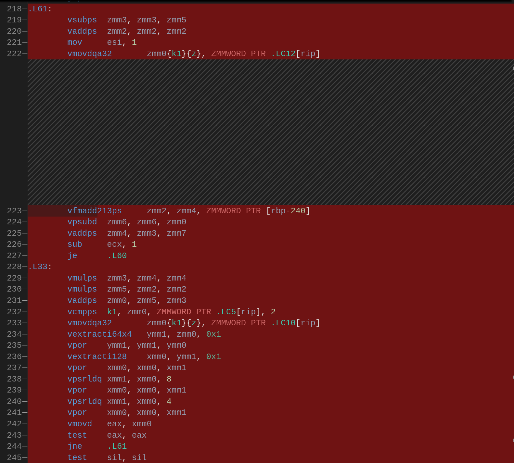</td>
<td>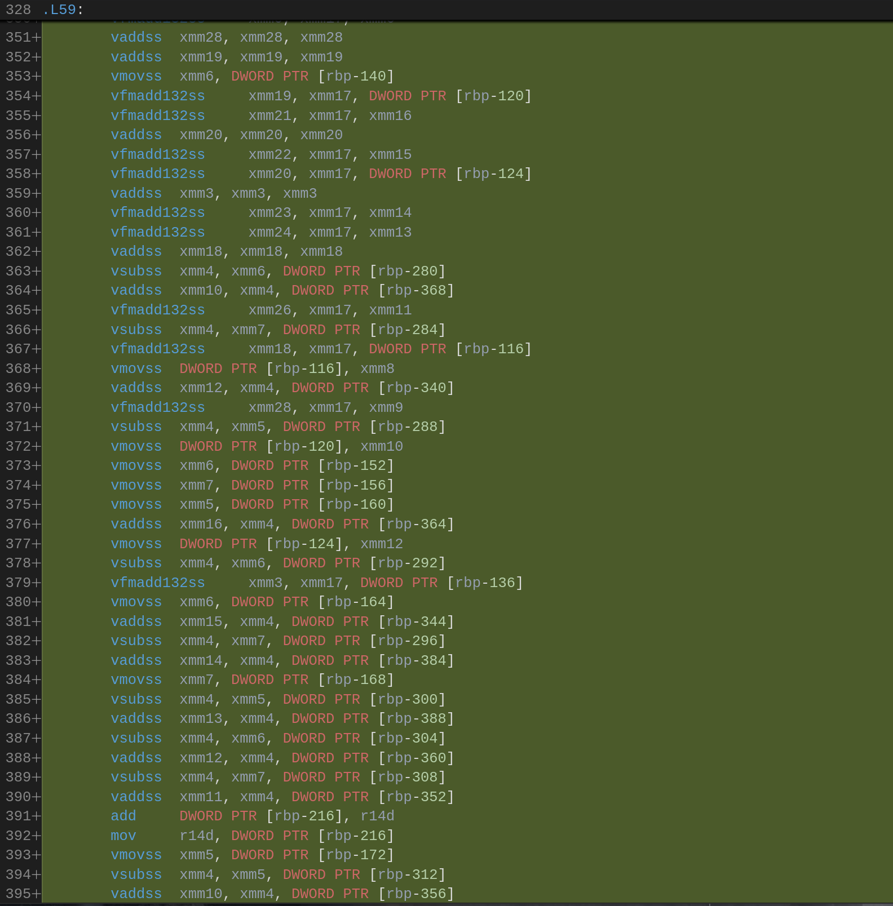</td>
</tr>
</table>

<!-- Здесь разница заключается в основном в том, что в версии -O3 напрямую делается call sqrtf,
а в версии -Ofast используется инструкция vsqrtss -->

## clang++ O3 vs Ofast (avx version)
<table>
<tr>
<td>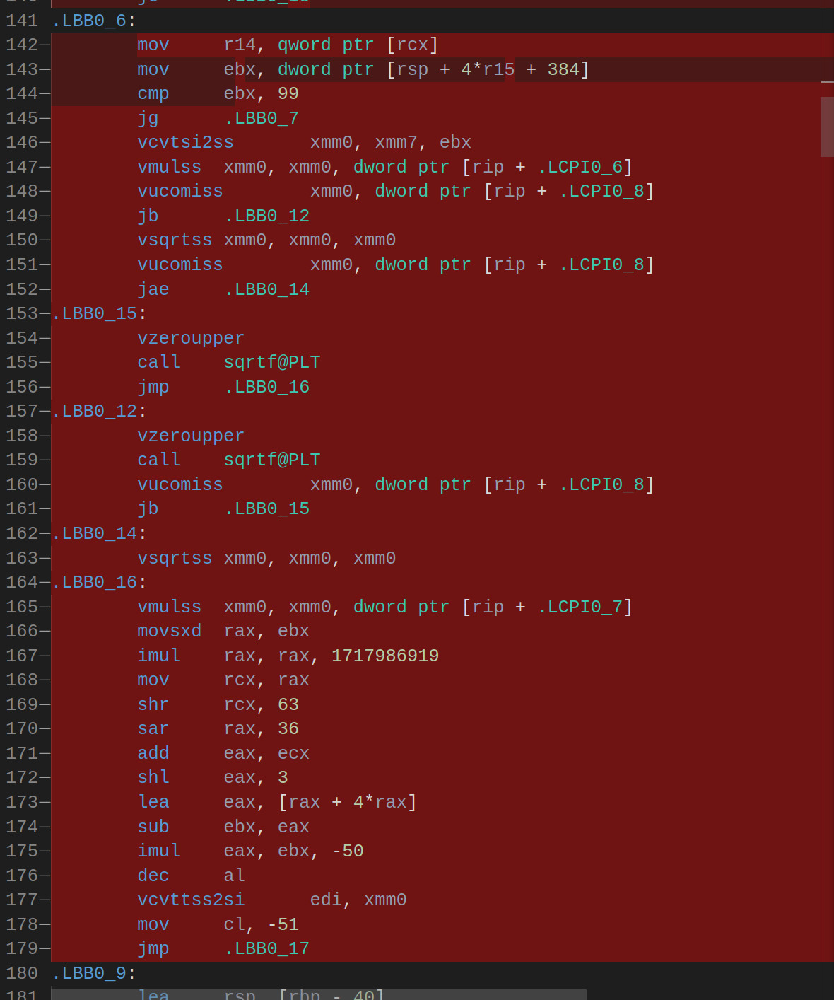</td>
<td>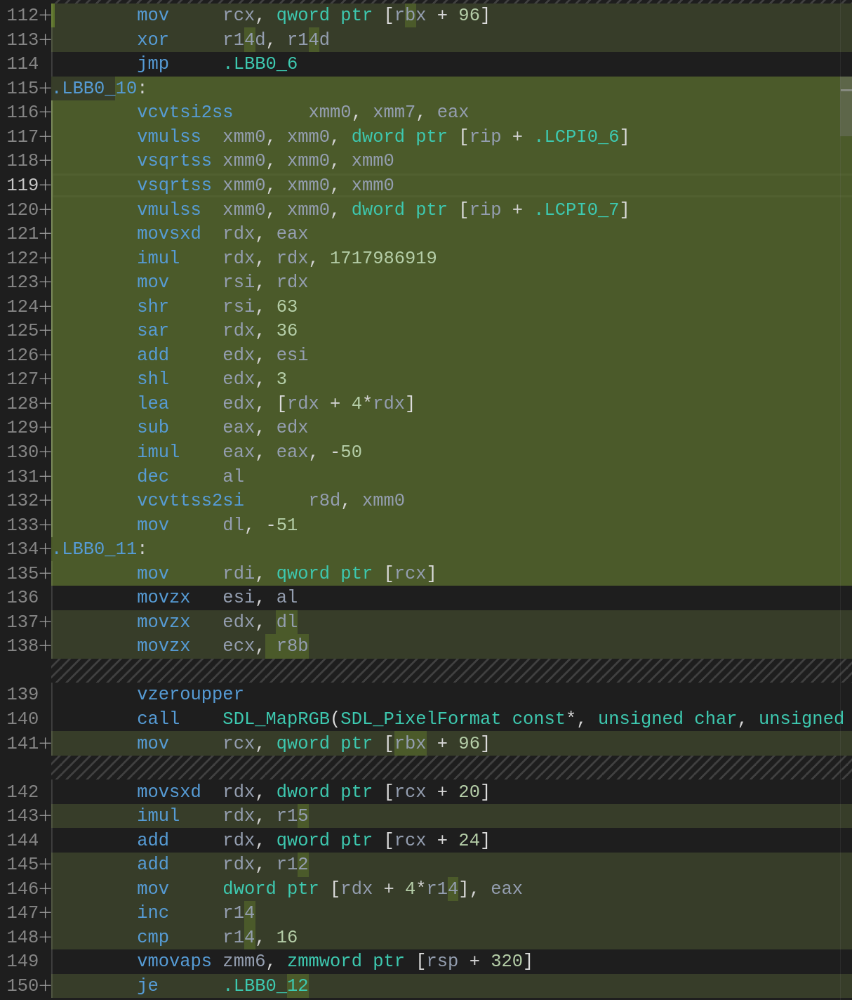</td>
</tr>
</table>

<!-- Компилятор clang в версии с массивами не смог полностью векторизовать код, используя частично xmm и частично ymm регистры,
из-за чего версия, скомпилированная компилятором clang оказалась примерно в 2 раза медленнее. -->

## clang++ O2 vs g++ O2 (arrays version)
<table>
<tr>
<td>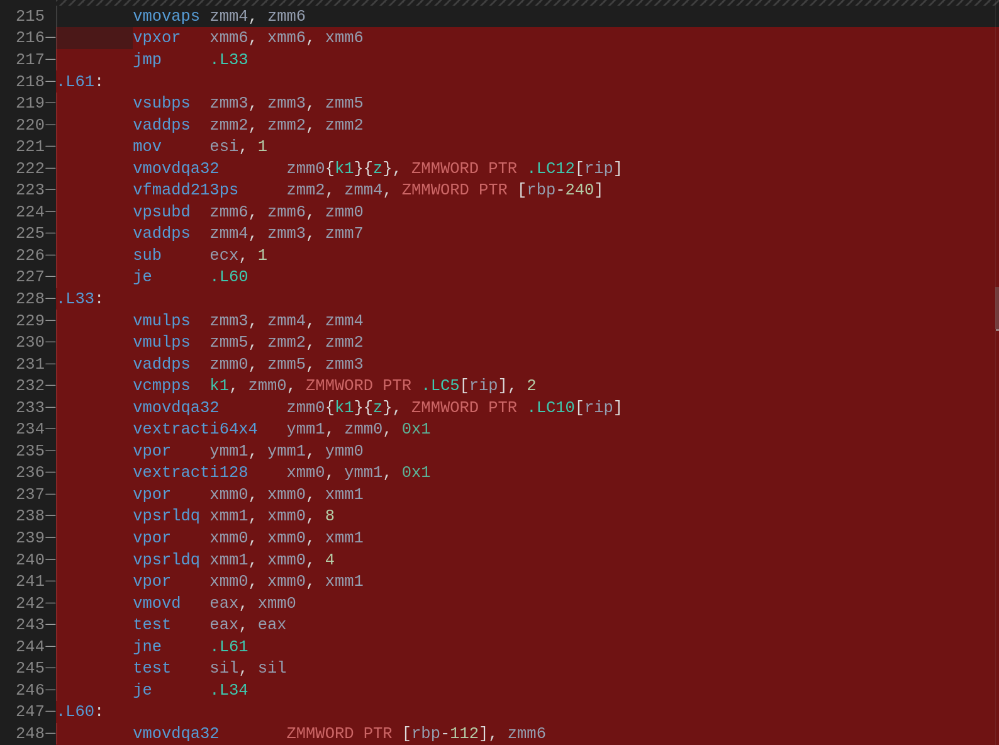</td>
<td>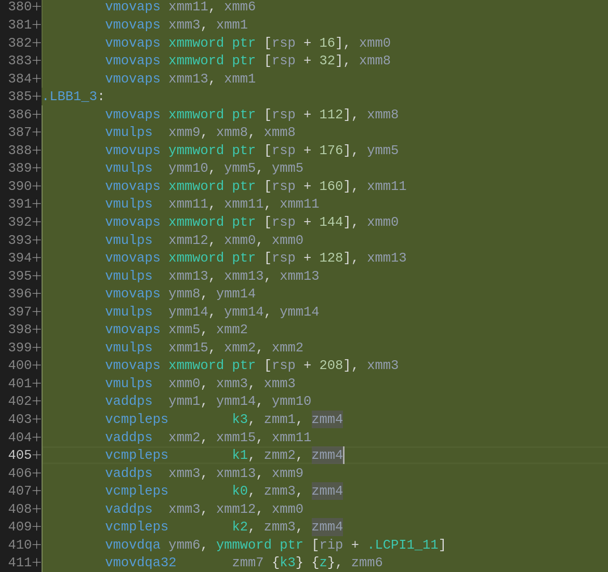</td>
</tr>
</table>

    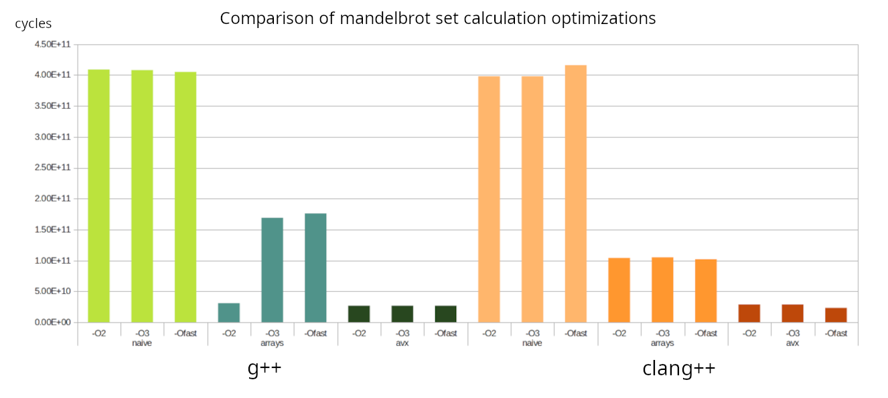

<!-- Для измерения состояния процессора была использована утилита **s-tui**. 
Данные, полученные с ее помощью, находятся в файле *cpu-data.csv*. 
Открыв файл в программе LibreOffice, я убедился что столбец Throttle пуст, что говорит
об отсутствии троттлинга в ходе проведения тестов -->

    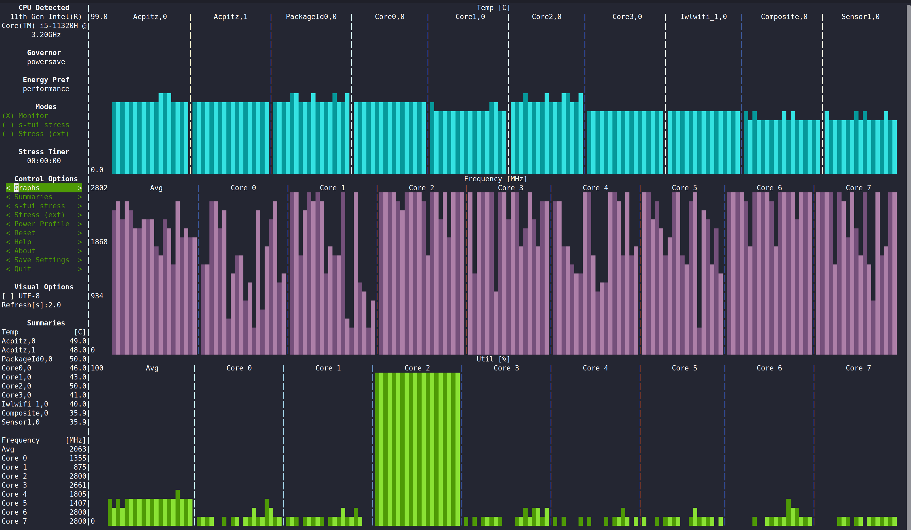

    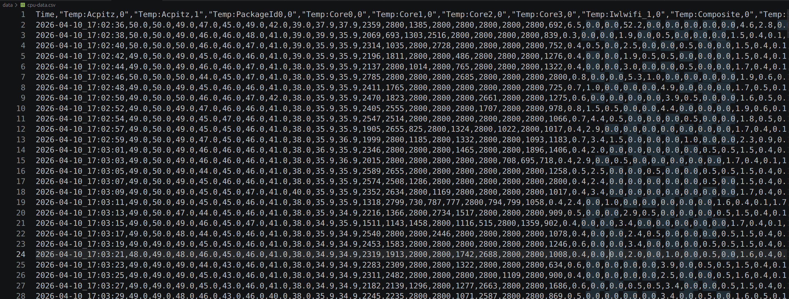

    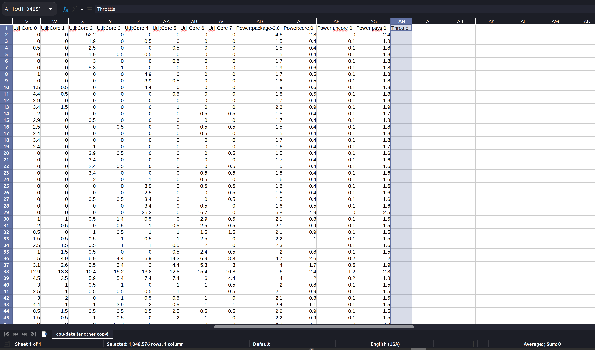

<!-- Температура при тестах не поднималась выше 60 градусов, что говорит об отсутствии троттлинга на производительность процессора. -->

    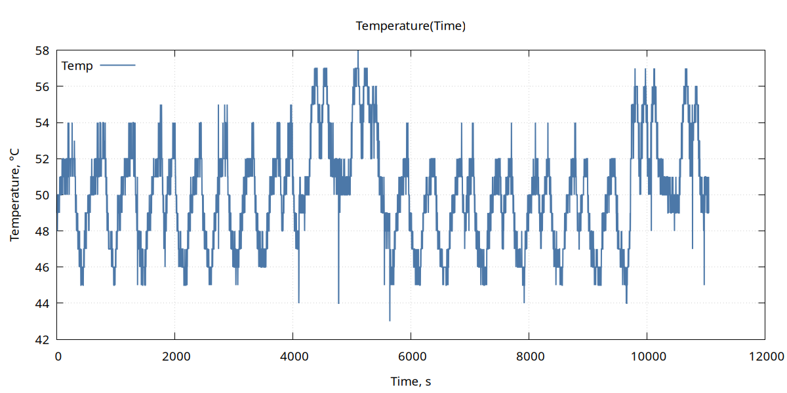

